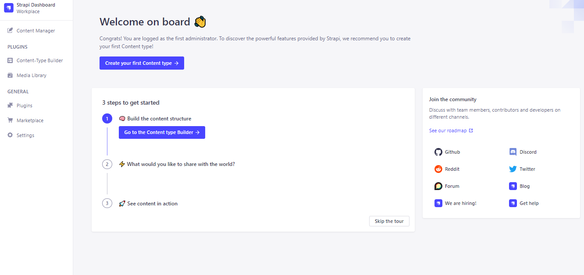

# How to create your own Strapi template

## Introduction

In this article, you will go through the steps on how to create your own Strapi template and share it with the community.

### What is Strapi?

[Strapi is the leading open-source headless Content Management System (CMS)](https://strapi.io). It is 100% Javascript, based on Node.js, and used to build RESTful APIs and GraphQL. It also has a cloud SAAS, ☁ [Strapi Cloud](https://strapi.io/cloud) ☁ - a fully managed, composable, and collaborative platform to boost your content velocity!

Strapi enables developers to build projects faster with a flexible and customizable platform for managing content. Check out the [Strapi Quickstart](https://docs.strapi.io/dev-docs/quick-start) guide for a brief intro.

One of the benefits of Strapi is that developers can create and share their own templates for others to use.

### What is a Strapi Template?

A [Strapi template](https://docs.strapi.io/dev-docs/templates) is a pre-made Strapi configuration that allows to you to bootstrap a custom Strapi application in one go. A template can configure [collection types and single types](https://docs.strapi.io/user-docs/content-type-builder), [components and dynamic zones](https://docs.strapi.io/dev-docs/backend-customization/models), and [plugins](https://docs.strapi.io/dev-docs/plugins/plugins-intro).

Templates can be useful in saving you time and getting up and running with a project. You can make templates for all sorts use cases. These include:
- Blog sites
- Ecommerce sites
- Corporate sites
- Personal sites

In this tutorial, you will make a Strapi template for a blog site. These instructions don't just apply to blogs, but can be used for ecommerce, corporate, personal and other sites as well.

If you are in a rush and want to test out the template here's the source code for the template:

- [**Source Code**](https://github.com/Marktawa/strapi-template-blog)

## Prerequisites

Before we begin, make sure you have the following software installed on your machine:

- [Node v14.xx to v18.xx (LTS version)](https://nodejs.org/en/download/)
- [Git](https://git-scm.com/downloads)

## Step 1: Create a standard Strapi app

The first step is to create a standard Strapi application. You can do this by running the following command in your terminal:

```
npx create-strapi-app myapp --quickstart

```

> **NOTE**
>
> Replace `myapp` with the name of your application.

This creates your Strapi app in the folder named `myapp`. The `--quickstart` flag sets up your Strapi app with an [SQLite](https://www.sqlite.org/index.html) database and automatically starts your server on port `1337`.

> **TIP**
>
> If the server is not already running, in your terminal, `cd` into the `myapp` folder and run `npm run develop` to launch it.

Visit `http://localhost:1337/admin` in your browser and register your details in the Strapi Admin Registration Form.


After registering your admin user, you should see the `Strapi Dashboard` in your browser.



## Step 2: Create Content for your Strapi app

The next step is to customize the Strapi application by creating blog template collections. This will involve creating content types, fields, and relationships that will serve as the foundation of your Strapi template.

The Content-type Builder plugin helps you to create your data structures for your content-types.

For your blog template, you will create a `Post` collection type with the following fields:

- `title` - for the title of the post
- `description` - for the description of the post
- `image` - for the post's cover image
- `content` - for the main content of the post

### Create Post collection type

1. Go to `Plugins` > `Content-type Builder` in the main navigation.
2. Select `+ Create new collection type` and name it `Post` and click `Continue`.


3. Add the following fields to your Post collection type:
- A `Text` field with name `title` and type `Short text`.
- A `Text` field with the name `description` and type `Long text`.
- A `Media` field with the name `image` and type `Single media`.
- A `Rich Text field` named `content`.


Click `Save` and wait for Strapi to restart. Once Strapi has restarted, `Post` will be listed under Content Manager > Collection types in the navigation.

### Add Relation Field

Let's add a relation between `Post` and `User` from the `users-permissions` plugin. This makes it easier to link a post to a user to display key data like the Author's name and profile picture, posts etc.

- Add a new `Relation` field to the `Post` content type. The column on the left should be `Post`, and the column on the right should be `User (from: users-permissions)`.
- Select the fourth relation, User has many Posts, and click `Finish`.


Click on `Save` and wait for the Strapi server to restart.

### Add Content to your Posts

The posts I am going to add to this template can be found [here](https://gist.github.com/Marktawa/97417c0a90e8d65d632b3bbc80f25c49). The images for the post can be found [here](https://github.com/Marktawa/strapi-template-blog-images).

Let’s create new entries for our blog posts:

- Go to `Content Manager` > `Collection types` - `Post`.
- Click on `Create new entry`.
- Add the `title`, `description`, `image`, and `content` to your blog entry.
- Click `Save` then `Publish`.


Repeat these steps to add multiple blog entries for the remaining posts. Go to `Content Manager` > `Collection types` - `Post` to see a list of your blog entries.


### Allow Access

For security reasons, the API access is restricted by default. We need to make the content available publicly through the API.

- Click on `Settings` under `GENERAL` at the bottom of the main navigation.
- Under `USERS & PERMISSIONS PLUGIN`, choose `Roles`.
- Click the `Public role`.
- In the `Permissions` tab, find `Post`, click on it and select the checkboxes next to `find` and `findone`.
- Select `Save`.


## Step 3: Test the Strapi API

Before generating your Strapi template, you will need to test your Strapi API to ensure that it works as intended. Test your application by running the following command in your terminal:

```bash
curl localhost:1337/api/posts
```

You should get a JSON payload similar to this:

```json
{
    "data": [
        {
            "id": 1,
            "attributes": {
                "title": "The Importance of Responsive Web Design",
                "description": "Learn why having a responsive web design is crucial for modern websites and how it can impact user experience and SEO.",
                "content": "In today's digital age, users access websites on a wide range of devices, from desktop computers to smartphones and tablets. As such, having a responsive web design is crucial for any website. A responsive design allows a website to adjust its layout and content to fit any screen size, ensuring that users have a seamless experience no matter how they access the website.\n\nResponsive web design also has a significant impact on search engine optimization (SEO). Search engines like Google prioritize websites that are optimized
...
```

> **NOTE:**
>
> Make sure your Strapi server is running before you test the API

## Step 4: Generate the Strapi template

Once you have tested and customized your Strapi application, you can generate a template by running the following command in your terminal:

```
cd myapp
npm run strapi generate:template blog
```

Replace `blog` with the name of your template.

The command will create a new folder with the name of your template at the root of the Strapi app folder.

## Step 5: Configure the template

After generating your Strapi template, you will need to configure it by modifying the template's `package.json` file. This file contains metadata about your template, such as its name, version, and dependencies.

Navigate to your template folder.

```bash
cd blog
```

You will see a `template` folder and a `template.json` file. The `template` folder has a `src` the following tree:

```bash
.
├── admin
│   ├── app.example.js
│   └── webpack.config.example.js
├── api
│   └── post
│       ├── content-types
│       │   └── post
│       │       └── schema.json
│       ├── controllers
│       │   └── post.js
│       ├── routes
│       │   └── post.js
│       └── services
│           └── post.js
├── extensions
└── index.js
```

The `api` folder stores the collection types you created. In this case, it is the `post` collection type. THe `index.js` file is used to run code before Strapi app starts.

## Step 6: Publish the template

Once you have configured your Strapi template, you can publish it to the npm registry or to a private npm registry. You can do this using the following command:

```
npm publish --access public

```

## Step 7: Test the template

After publishing your Strapi template, you should test it to ensure that it works as intended. You can do this by creating a new Strapi application using your template and testing its functionality.

## Step 8: Deployment

Finally, you can deploy your Strapi template to a hosting provider, such as Heroku or AWS, to make it accessible to the wider community.

## Recommendations

When creating a Strapi template, it's important to follow best practices and maintain good documentation. This will make it easier for others to use your template and contribute to its development.

## Conclusion

Creating your own Strapi template can be a rewarding experience that allows you to share your knowledge and expertise with the wider community. By following the steps outlined in this article, you can create a high-quality Strapi template that others can use to build their own applications.